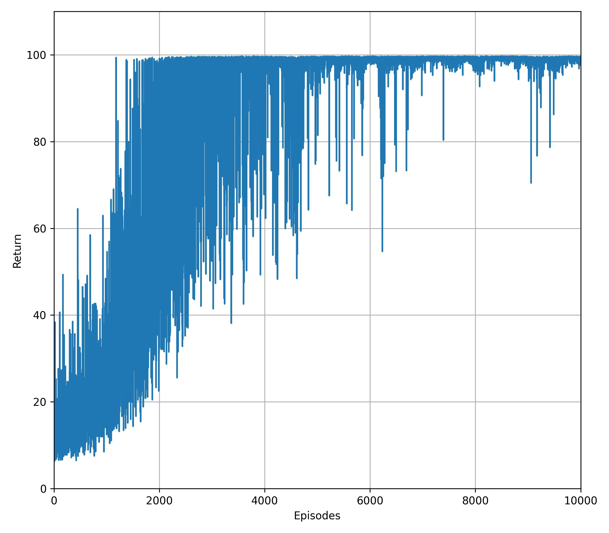

# Proximal Policy Optimization (PPO)

## Summary
This is a tutorial on how to implement Schulman's proximal policy optimization (PPO) algorithm in PyTorch. The advantage estimation scheme used in this implementation is Schulman's generalized advantage estimator (GAE) with $\lambda=1$. Thus, the critic approximates the state-value function.

## Results
The algorithm was tested in a modified Pendulum environment. The graph shows the return per episode. 

    

## Dependencies
You'll need a working Python environment to run the code.
The recommended way to set up your environment is through [virtual environments](https://docs.python.org/3/library/venv.html). The required dependencies are specified in the file `requirements.txt`.